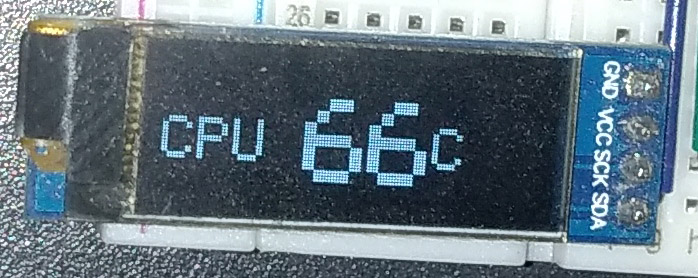
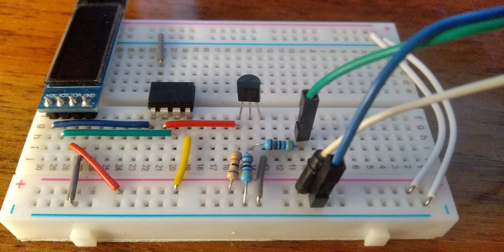

# ATtiny13 Serial Display
With this project you can send a text to Serial port and get the text on a display without additional software. It can be especially usefull on servers and NASes without displays.

## Components
- ATtiny13
- SSD1306 0.96' OLED display 128x32
- Option #1: 2x 4.7K and 10K resistors and BC548 or analog
- Option #2: USB-UART Converter with 3.3V support

Check [Wiki](https://github.com/little-brother/attiny13-serial-display/wiki) to get circuits and another details. If you have any proplems with this project just let me know <a href="mailto:lb-im@ya.ru?subject=attiny13-serial-display">lb-im@ya.ru</a>.

